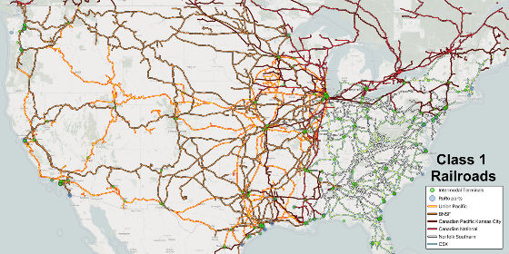

# INFORMS RAS 2026 Problem Solving Competition

## Railroad Blocking Problem for North American Class I Railroads — Public Benchmark Archive



<sub>Header image: "US railway map" by [Wikideas1](https://commons.wikimedia.org/wiki/User:Wikideas1), [Wikimedia Commons](https://commons.wikimedia.org/wiki/File:US_railway_map.webp), [CC0 1.0](https://creativecommons.org/publicdomain/zero/1.0/) (public domain); own work created with QGIS using U.S. Bureau of Transportation Statistics data. Shown here as an illustrative overview of the Class I railroad network, intermodal terminals, and RoRo ports; it is not the benchmark network.</sub>

This site is the **ASU Trans+AI Lab research mirror and archival benchmark package** for the INFORMS Railway Applications Section (RAS) 2026 Problem Solving Competition. It hosts the benchmark instances, schemas, validators, scoring tools, and documentation for reproducible railroad-blocking algorithm development. It does not replace the official competition pages.

<p>
<a class="btn" href="https://www.kaggle.com/competitions/informs-ras-2026-problem-solving-competition">Kaggle competition page</a>
<a class="btn" href="https://connect.informs.org/railway-applications/new-item3/problem-solving-competition682">INFORMS RAS competition page</a>
<a class="btn" href="https://github.com/asu-trans-ai-lab/RAS2026-PSC">GitHub repository</a>
</p>

---

## Official announcements

- **Kaggle — INFORMS RAS 2026 Problem Solving Competition**
  <https://www.kaggle.com/competitions/informs-ras-2026-problem-solving-competition>
  The Kaggle competition page is an authoritative source for the competition description, participation information, announcements, and competition materials.
- **INFORMS Railway Applications Section — 2026 Problem Solving Competition**
  <https://connect.informs.org/railway-applications/new-item3/problem-solving-competition682>
  The INFORMS Railway Applications Section page is an authoritative source for the competition organization, leadership, timeline, and official RAS information.

---

## Please cite

> Peiheng Li and Xuesong (Simon) Zhou. *INFORMS RAS 2026 Problem Solving Competition*. Kaggle, 2026.
> <https://www.kaggle.com/competitions/informs-ras-2026-problem-solving-competition>

```bibtex
@misc{li_zhou_ras2026,
  author       = {Li, Peiheng and Zhou, Xuesong (Simon)},
  title        = {INFORMS RAS 2026 Problem Solving Competition},
  year         = {2026},
  howpublished = {Kaggle},
  url          = {https://www.kaggle.com/competitions/informs-ras-2026-problem-solving-competition}
}
```

Users relying on upstream public source datasets should additionally cite the applicable original sources, including FAF and OpenStreetMap, as appropriate.

---

## Research benchmark and data provenance notice

> RAS2026-PSC is a research-derived and benchmark-calibrated competition dataset created for the INFORMS RAS 2026 Problem Solving Competition. It is not an operational or proprietary railroad dataset. Demand records were developed using transformed Freight Analysis Framework (FAF)-based freight-flow references; users seeking original FAF data should obtain it directly from the official BTS/FAF sources. Physical network connectivity is research-derived in part from OpenStreetMap and additional competition-specific research curation. Applicable OpenStreetMap attribution and ODbL terms remain with OSM-derived components. Benchmark yard definitions, capacities, costs, and other parameters are research abstractions for algorithmic evaluation and should not be interpreted as current railroad operating data. Participants and users take full responsibility and liability for their use of the materials.

Full notice: [DATA_PROVENANCE_AND_USE.md](https://github.com/asu-trans-ai-lab/RAS2026-PSC/blob/main/DATA_PROVENANCE_AND_USE.md) · Notices: [NOTICE.md](https://github.com/asu-trans-ai-lab/RAS2026-PSC/blob/main/NOTICE.md)

---

## The problem in brief

Railcars are consolidated into **blocks** at classification yards and travel intact between yards. Given a physical rail network and yard-to-yard commodity demand, participants build a **zero-based blocking plan**: which blocks to open, the single sequence of blocks each commodity follows, and the physical route of each block. Plans are checked for feasibility (constraints C1–C8) and ranked by total cost (block fixed, transportation, classification handling, interchange), with a volume-weighted Stress Score when full feasibility is unattainable. Three network layers (L1, L2, L3) × three demand multipliers (0.5×, 1.0×, 2.0×) form the nine official cases.

<p>
<a class="btn" href="problem_statement.pdf">Problem statement (PDF)</a>
</p>

---

## Downloads

<p>
<a class="btn" href="https://github.com/asu-trans-ai-lab/RAS2026-PSC/releases/tag/v2.1">Full package — GitHub Release v2.1</a>
<a class="btn" href="https://github.com/asu-trans-ai-lab/RAS2026-PSC/archive/refs/heads/main.zip">Repository ZIP (compressed inputs)</a>
<a class="btn" href="https://github.com/asu-trans-ai-lab/RAS2026-PSC/blob/main/SHA256SUMS.txt">SHA-256 checksums</a>
</p>

| Item | Location |
|---|---|
| Per-layer inputs (`node.csv`, `demand.csv`, `setting.csv`, `yard_car_demand_summary.csv`, `link.csv.zip`) | `datasets/l1/`, `datasets/l2/`, `datasets/l3/` |
| Yard-to-yard distance matrix | `datasets/yard_to_yard_min_distance.csv.zip` |
| JSON schemas and CSV validator | `datasets/schemas/` |
| Validator, metric notebook, packing scripts, sample solutions | `scoring/` |
| Field reference | [datasets/DATASET_README.md](https://github.com/asu-trans-ai-lab/RAS2026-PSC/blob/main/datasets/DATASET_README.md) |
| Scoring reference | [scoring/SCORE_README.md](https://github.com/asu-trans-ai-lab/RAS2026-PSC/blob/main/scoring/SCORE_README.md) |

Quick start:

```bash
git clone https://github.com/asu-trans-ai-lab/RAS2026-PSC.git
cd RAS2026-PSC
pip install -r requirements.txt
python unpack.py
python datasets/schemas/validate_csvs.py
cd scoring
python fast_validator_v2_0.py solution_result_l1_10.json --od-matrix od_distance_matrix.csv
```

---

## Competition leadership

- **Competition Chair** — Xuesong Zhou, Professor of Transportation Systems, Arizona State University (xzhou74@asu.edu)
- **Co-Chair** — Natalia Zuniga Garcia, Computational Transportation Engineer, Argonne National Laboratory (nzuniga@anl.gov)
- **Problem Owner** — Dr. Peiheng Li, Norfolk Southern Corporation

Institutional affiliations are provided to identify the competition leadership and problem-development roles. Their listing should not be interpreted as a separate institutional license, sponsorship statement, operational endorsement, or transfer of ownership of the released benchmark.

**Judging committee**

| Name | Organization |
|---|---|
| Cynthia Barnhart | MIT |
| Ravi Ahuja | Optym |
| David Hunt | Oliver Wyman |
| Michael Hewitt | Loyola University Chicago |
| Gunnar Feldmann | Norfolk Southern |
| Edward Lin | Independent / retired Norfolk Southern |
| Clark Cheng | RailTek |
| Marc Meketon | Independent |
| John Fuller | Union Pacific |
| Carl Van Dyke | CVD Zone |
| Baoyu Zhou | Arizona State University |

Affiliations are listed for identification only.

---

## Upstream sources

**Freight Analysis Framework (FAF)** — U.S. Bureau of Transportation Statistics (BTS); FAF5 developed with support from the Federal Highway Administration (FHWA).

- FAF5 main page: <https://www.bts.gov/faf/faf5>
- FAF5 Data Tabulation Tool: <https://faf.ornl.gov/faf5/dtt_total.aspx>
- FAF5.7.1 Regional Database: <https://faf.ornl.gov/faf5/data/download_files/FAF5.7.1.zip>
- FAF5.7.1 State Database: <https://faf.ornl.gov/faf5/data/download_files/FAF5.7.1_State.zip>
- Permanent FAF5 dataset DOI: <https://doi.org/10.21949/1529116>
- Current BTS FAF portal: <https://www.bts.gov/faf>

FAF5 is listed because it belongs to the provenance family used in developing the RAS 2026 benchmark. The current BTS FAF portal may contain newer FAF generations; do not assume a later FAF release was used unless explicitly documented.

**OpenStreetMap (OSM)** — **© OpenStreetMap contributors**, Open Database License (ODbL) 1.0.

- Copyright and license: <https://www.openstreetmap.org/copyright>
- OSM Foundation License and Legal FAQ: <https://osmfoundation.org/wiki/Licence_and_Legal_FAQ>

---

## Licenses and notices

Project-authored code is MIT-licensed ([LICENSE-CODE](https://github.com/asu-trans-ai-lab/RAS2026-PSC/blob/main/LICENSE-CODE)); the code license does not extend to the datasets or third-party-derived data, and no blanket data license is asserted. See [DATA_PROVENANCE_AND_USE.md](https://github.com/asu-trans-ai-lab/RAS2026-PSC/blob/main/DATA_PROVENANCE_AND_USE.md) and [NOTICE.md](https://github.com/asu-trans-ai-lab/RAS2026-PSC/blob/main/NOTICE.md).

*RAS2026-PSC is an openly accessible research benchmark archive for reproducible railroad-blocking algorithm development. It integrates transformed public freight-flow references, open spatial/network references, and competition-specific research curation, while preserving the attribution and use conditions of the underlying sources.*
